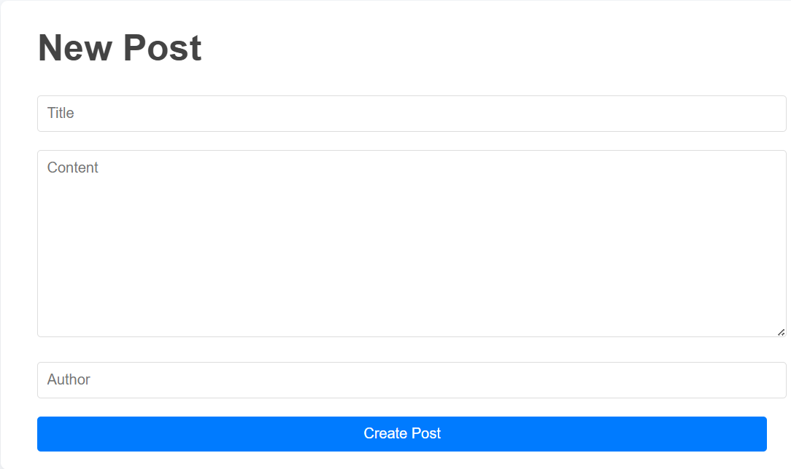
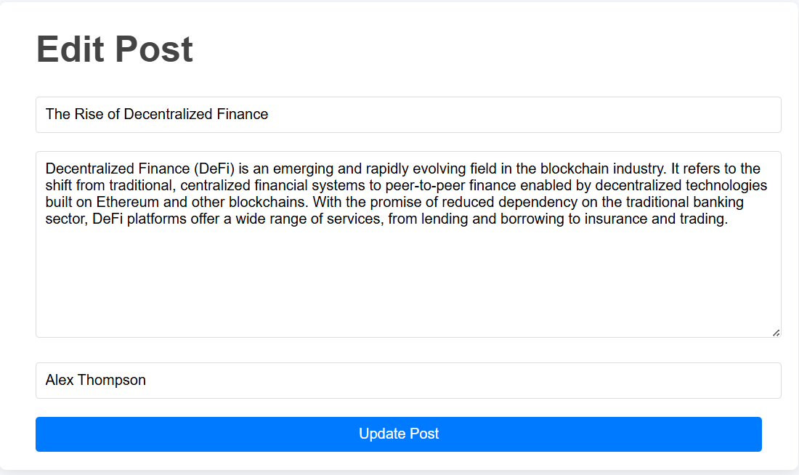

# blog-api
A blog web application that can create new posts, edit existing posts and delete the posts. Created using JavaScript, Node.js, Express.js, EJS, REST API.
Installation:
1.Clone the repository git clone https://github.com/varshita2717/blog-api/
2.Navigate to the project folder cd blog-api

3.Install dependencies npm install or npm i

4.Start the server for the index.js using:- node index.js or with nodemon : nodemon index.js' 
5.Start the server for the server.js using:- node server.js or with nodemon : nodemon server.js' 

Overview:
## Home Page

## New Post

## Edit Post

